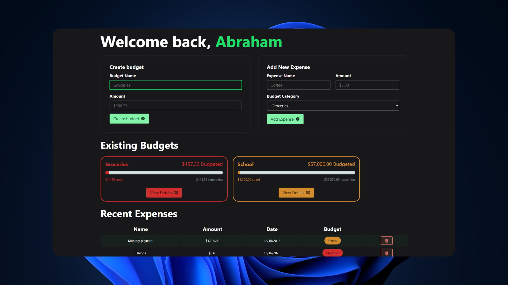
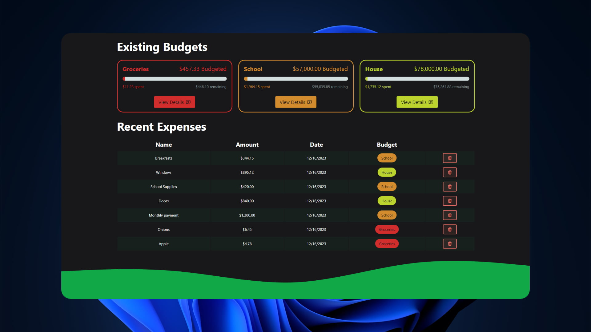
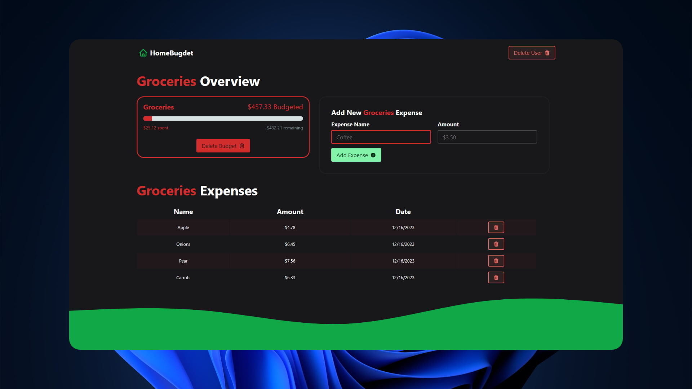

# 💲 React Router: Budget App

### Aplicación de presupuesto hecha con React Router.

> 🧩 Aquí puedes ver su [**Live Demo.**](https://budget-app-abraham.netlify.app/)

## 🚀 Descripción

Este proyecto es una aplicación de presupuesto hecha con **react-router-dom**.

Permite crear presupuestos por categoría, agregar, eliminar o editar los presupuestos creados.

## 🎭 Tecnologías

El proyecto utiliza las siguientes tecnologías:

- [**react-router-dom**](https://reactrouter.com/en/main) para crear el enrutado de la página.
- [**heroicons**](https://heroicons.com/) para crear iconos agradables.
- [**react-toastify**](https://www.npmjs.com/package/react-toastify) para mostrar notificaciones al crear, eliminar o editar un presupuesto.
